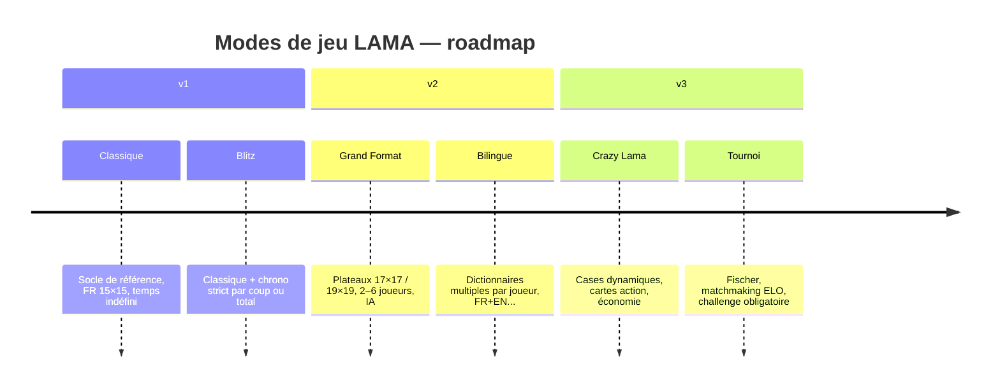

# Modes de jeu LAMA 🦙 — définition, descriptifs et grilles

**Date** : 2026-06-24
**Statut** : Proposition

---

## Objectif

Définir clairement les **6 modes de jeu** du projet LAMA, de la v1 jusqu'aux versions futures.

Ce document est la **référence produit** pour les modes nommés. Il complète :

- [`MODES_ET_OPTIONS_GRILLE_DECISION.md`](MODES_ET_OPTIONS_GRILLE_DECISION.md) — grille fine des options et variantes ;
- [`PERIMETRE.md`](../roadmap/PERIMETRE.md) — backlog "Crazy Lama" et épics détaillées ;
- [`MULTILANGUE_JEU_BILINGUE.md`](MULTILANGUE_JEU_BILINGUE.md) — spécification du mode Bilingue.

> Règle d'interprétation : si ce document diverge du code, le code fait foi.

---

## 📋 Grille de présentation synthétique

| Mode | ID | Version | Joueurs | Plateau | Temps | Langue(s) | IA | Bonus/Malus | Niveaux |
|------|----|---------|---------|---------|-------|-----------|----|-------------|---------|
| 🎯 [Classique](#1--classique) | `classic` | **v1** | 2–4 | 15×15 | Indéfini | 1 (`fr`) | — | Officiels fixes | Casual · Standard · Competitive |
| ⚡ [Blitz](#2--blitz) | `blitz` | **v1** | 2–4 | 15×15 | Limité (global ou par coup) | 1 (`fr`) | — | Officiels fixes | Casual · Standard |
| 🗺️ [Grand Format](#3--grand-format) | `grand` | v2 | 2–6 | 17×17 / 19×19 | Indéfini ou chronométré | 1 (`fr`) | optionnel | Officiels étendus | Casual · Standard |
| 🌍 [Bilingue](#4--bilingue) | `bilingual` | v2 | 2–4 | 15×15 | Indéfini | 2+ (`fr`+`en`…) | — | Officiels par joueur | Casual · Standard |
| 🎲 [Crazy Lama](#5--crazy-lama) | `crazy` | v3 | 2–4 | 15×15 | Indéfini ou chronométré | 1 (`fr`) | — | Dynamiques + cartes | Casual |
| 🏆 [Tournoi](#6--tournoi) | `tournament` | v3 | 2–4 | 15×15 | Fischer | 1 (`fr`) | — | Officiels fixes | Tournament |

### Lecture de la grille

- **Version** : jalon cible de première disponibilité jouable ;
- **Niveaux** : valeurs du `GameLevel` existant (`Casual`, `Standard`, `Competitive`, `Tournament`) compatibles avec ce mode ;
- **Bonus/Malus** : type de cases spéciales actives sur le plateau ;
- **IA** : disponibilité d'un ou plusieurs joueurs IA dans ce mode.

---

## 🗺️ Vue d'ensemble — roadmap des modes



---

## 📖 Détail par mode

---

### 1 🎯 Classique

**Identifiant** : `classic` · **Version cible** : v1

#### Description

Le mode de référence absolu. Il reproduit fidèlement les règles du Scrabble officiel sur plateau
15×15 avec le sac français. Toutes les variantes et tous les autres modes sont définis *par rapport*
à ce socle. Aucune mécanique supplémentaire n'est active.

C'est le seul mode où le classement ELO compétitif est pleinement significatif dès la v1.

#### Paramètres

| Paramètre | Valeur |
|-----------|--------|
| Plateau | 15×15 |
| Case de départ | H8 (centre) |
| Carte des bonus | Officielle Scrabble (MW×2, MW×3, ML×2, ML×3) |
| Taille du rack | 7 lettres |
| Sac | FR officiel — 102 tuiles, dont 2 jokers |
| Longueur minimale d'un mot | 2 lettres |
| Bonus scrabble | +50 points pour 7 tuiles posées |
| Langue / dictionnaire | Français (`fr`) |
| Nombre de joueurs | 2 à 4 |
| Joueur IA | Non |
| Temps | Indéfini |
| Aides disponibles | Selon `GameLevel` — hint, dict check, dry-run (Casual uniquement) |
| Bonus/Malus dynamiques | Non |
| Cartes action | Non |

#### Condition de fin

Sac vide **et** rack vide du joueur ayant posé son dernier mot.
Chaque joueur restant voit sa valeur de rack déduite ; le joueur vidant son rack reçoit le cumul des racks adverses.

#### Niveaux applicables

| GameLevel | Comportement |
|-----------|-------------|
| `Casual` | Toutes les aides actives — hints, dict check, dry-run, simulate. |
| `Standard` | Aides désactivées ; challenge autorisé. |
| `Competitive` | Aides désactivées ; challenge obligatoire ; logs stricts. |

#### 📊 Statut d'implémentation

| Composant | Statut |
|-----------|--------|
| Moteur de jeu (15×15, rack 7, sac FR) | **Implémenté** |
| Bonus officiels (`BonusMap`) | **Implémenté** |
| Validation et scoring | **Implémenté** |
| CLI locale (create, play, show, pass, swap, challenge) | **Implémenté** |
| Mode online (serveur, lobby, multi) | **Implémenté** |
| Classement ELO | **Implémenté** |

---

### 2 ⚡ Blitz

**Identifiant** : `blitz` · **Version cible** : v1

#### Description

Le mode Blitz reprend les règles du mode Classique à l'identique, mais y ajoute une **contrainte
de temps**. L'objectif est de créer une expérience de jeu plus tendue et rythmée, adaptée aux
parties courtes entre joueurs qui se connaissent bien.

Deux variantes de contrainte temporelle sont envisagées :

- **Temps total par joueur** — ex. : 5, 10 ou 15 minutes. Chaque joueur dispose d'un capital
  temps global qui décompte à chacun de ses tours. À l'épuisement, le joueur passe automatiquement ;
- **Temps par coup** — ex. : 30, 60 ou 90 secondes. Chaque coup doit être joué avant expiration
  du chrono du tour ; sans coup joué, le tour est automatiquement passé.

La cadence par défaut proposée est **10 minutes par joueur** (temps total).

#### Paramètres

| Paramètre | Valeur |
|-----------|--------|
| Plateau | 15×15 (identique au Classique) |
| Case de départ | H8 (centre) |
| Carte des bonus | Officielle Scrabble |
| Taille du rack | 7 lettres |
| Sac | FR officiel — 102 tuiles, dont 2 jokers |
| Longueur minimale d'un mot | 2 lettres |
| Bonus scrabble | +50 points pour 7 tuiles posées |
| Langue / dictionnaire | Français (`fr`) |
| Nombre de joueurs | 2 à 4 |
| Joueur IA | Non |
| Temps | **Limité** — `total/joueur` ou `par coup` (paramétrable à la création) |
| Cadences proposées | 5 min · 10 min · 15 min (total) / 30 s · 60 s · 90 s (par coup) |
| Aides disponibles | Selon `GameLevel` (Casual ou Standard uniquement) |
| Bonus/Malus dynamiques | Non |
| Cartes action | Non |

#### Condition de fin

Idem Classique, **plus** : épuisement du temps d'un ou de tous les joueurs.
Le joueur dont le temps expire passe automatiquement son tour pour le reste de la partie.

#### Niveaux applicables

| GameLevel | Comportement |
|-----------|-------------|
| `Casual` | Aides actives ; temps indulgent (15 min conseillés). |
| `Standard` | Aides désactivées ; challenge autorisé dans le temps imparti. |

#### 📊 Statut d'implémentation

| Composant | Statut |
|-----------|--------|
| Socle Classique | **Implémenté** |
| Moteur de chrono (serveur + CLI) | **Futur** |
| Expiration automatique du tour | **Futur** |
| Paramètre `--time-mode` / `--time-limit` à la création | **Futur** |
| Affichage du chrono dans `game.show` | **Futur** |

---

### 3 🗺️ Grand Format

**Identifiant** : `grand` · **Version cible** : v2

#### Description

Le mode Grand Format adapte le plateau et les règles pour accueillir **plus de joueurs** et des
parties plus longues et stratégiques. Il propose deux tailles de plateau : 17×17 et 19×19.

Un plateau plus grand implique une carte des bonus étendue (recalculée proportionnellement),
un sac plus fourni, et éventuellement un rack de 8 ou 9 lettres pour maintenir la densité
de jeu. La IA devient disponible pour compléter les parties à 3, 4, 5 ou 6 joueurs.

Ce mode est pensé pour les **soirées de jeu en groupe** ou les parties en famille.

#### Paramètres

| Paramètre | Valeur |
|-----------|--------|
| Plateau | **17×17** ou **19×19** (choix à la création) |
| Case de départ | Centre du plateau |
| Carte des bonus | Officielle étendue proportionnellement à la taille |
| Taille du rack | 7 (défaut) · 8 · 9 (options) |
| Sac | FR officiel étendu (adapté à la taille du plateau) |
| Longueur minimale d'un mot | 2 lettres |
| Bonus scrabble | +50 points pour rack entier posé |
| Langue / dictionnaire | Français (`fr`) |
| Nombre de joueurs | **2 à 6** |
| Joueur IA | **Oui** — 1 ou plusieurs slots IA possibles |
| Temps | Indéfini ou chronométré (mêmes variantes que Blitz) |
| Aides disponibles | Selon `GameLevel` |
| Bonus/Malus dynamiques | Non |
| Cartes action | Non |

#### Condition de fin

Idem Classique. La fin de sac combinée à un rack vide reste la condition primaire.

#### Niveaux applicables

| GameLevel | Comportement |
|-----------|-------------|
| `Casual` | Toutes aides actives ; idéal en famille. |
| `Standard` | Aides désactivées. |

#### 📊 Statut d'implémentation

| Composant | Statut |
|-----------|--------|
| `BoardSize` dans contrats et persistance | **Partiel** — stocké, non respecté par le domaine |
| `BonusMap` variable selon la taille | **Futur** |
| Moteur adaptatif (plateau N×N) | **Futur** |
| Sac étendu en fonction de la taille | **Futur** |
| `RackSize` variable dans le moteur | **Partiel** — contrats OK, moteur fixé à 7 |
| Slots IA comportementaux | **Partiel** — flag présent, comportement absent |

---

### 4 🌍 Bilingue

**Identifiant** : `bilingual` · **Version cible** : v2

#### Description

Le mode Bilingue permet à des joueurs de **langues différentes** de s'affronter sur le même
plateau. Chaque joueur dispose de son propre dictionnaire et de son propre barème de lettres.
Un mot posé sur le plateau est validé **selon la langue du joueur qui le pose**. Les croisements
inter-langues sont acceptés si le mot est valide dans la langue du joueur poseur.

Ce mode est une déclinaison du Classique : les règles du plateau, du rack et du scoring restent
identiques ; seuls le dictionnaire de validation et la distribution des tuiles varient par joueur.

Ce mode est également prévu comme **option transversale** activable dans d'autres modes (Grand
Format bilingue, Blitz bilingue) dans une version ultérieure.

La spécification détaillée est disponible dans [`MULTILANGUE_JEU_BILINGUE.md`](MULTILANGUE_JEU_BILINGUE.md).

#### Paramètres

| Paramètre | Valeur |
|-----------|--------|
| Plateau | 15×15 |
| Case de départ | H8 (centre) |
| Carte des bonus | Officielle Scrabble |
| Taille du rack | 7 lettres |
| Sac | **Mixte** — un sac unifié ou deux sacs distincts par joueur (à trancher) |
| Longueur minimale d'un mot | 2 lettres |
| Bonus scrabble | +50 points pour 7 tuiles posées |
| Langue / dictionnaire | **2 ou 3 langues** (ex : `fr`, `en`, `es`) — assignées par joueur |
| Nombre de joueurs | 2 à 4 |
| Joueur IA | Non (envisageable à terme) |
| Temps | Indéfini |
| Aides disponibles | Selon `GameLevel` ; aide filtrée par langue du joueur |
| Bonus/Malus dynamiques | Non |
| Cartes action | Non |

#### Questions ouvertes (à trancher avant implémentation)

- **Sac unifié ou sac par joueur ?** — un sac unique (lettres universelles) ou un sac propre à chaque langue ;
- **Scoring des croisements** — la lettre déjà posée est-elle comptée avec le barème de son propriétaire ou du joueur courant ;
- **Validation des croisements** — suffit-il que le mot soit valide dans la langue du poseur, ou faut-il également vérifier la langue de l'adversaire.

#### Condition de fin

Idem Classique.

#### Niveaux applicables

| GameLevel | Comportement |
|-----------|-------------|
| `Casual` | Aides actives, filtrées par langue du joueur courant. |
| `Standard` | Aides désactivées. |

#### 📊 Statut d'implémentation

| Composant | Statut |
|-----------|--------|
| Interface `IGameLanguageProvider` | **Implémenté** — abstraction multilingue prête |
| Provider FR | **Implémenté** |
| Provider EN (et autres langues) | **Futur** |
| Assignation de langue par joueur | **Futur** |
| Validation croisée multi-langue | **Futur** |
| Distribution mixte des tuiles | **Futur** |
| Affichage dans `game.show` (langue par joueur) | **Futur** |

---

### 5 🎲 Crazy Lama

**Identifiant** : `crazy` · **Version cible** : v3

#### Description

Le mode Crazy Lama est le mode **fun et chaotique** du projet. Il conserve le socle classique
du plateau et du scoring, mais y greffe trois couches de mécaniques supplémentaires qui créent
de l'imprévisibilité, de la stratégie de court terme et des interactions entre joueurs.

**Couche 1 — Cases dynamiques**

Des bonus et malus sont attribués aléatoirement sur le plateau en début de partie (seed persistante
pour reproductibilité). Trois variantes de visibilité :

- `visible` — tous voient les cases spéciales dès le début ;
- `hidden` — l'effet est révélé au moment de la pose ;
- `fog` — visibilité locale autour du dernier coup joué.

Types de cases envisagés : `+N pts`, `×2/×3 mot`, `×2/×3 lettre`, `-N pts`, annulation du bonus classique.

**Couche 2 — Cartes action**

Chaque joueur pioche des cartes à certains moments de la partie. Trois familles :

- *Boost* — doubler/tripler le prochain mot, bonus sur mots croisés, bonus sur mots longs (≥ 6 lettres) ;
- *Protection* — immunité contre une attaque, annulation de malus, conservation du score minimal ;
- *Attaque* (v3 avancé) — réduction de score adverse, blocage temporaire, taxe de rack.

**Couche 3 — Économie de points**

Certaines aides/actions deviennent payantes (coût configurable) — `play.check`, consultation du
dictionnaire, achat d'une lettre ciblée depuis le sac.

La spécification détaillée est disponible dans [`PERIMETRE.md`](../roadmap/PERIMETRE.md).

#### Paramètres

| Paramètre | Valeur |
|-----------|--------|
| Plateau | 15×15 |
| Case de départ | H8 (centre) |
| Carte des bonus | Officielle Scrabble **+ cases dynamiques aléatoires** (seed paramétrable) |
| Taille du rack | 7 lettres |
| Sac | FR officiel |
| Longueur minimale d'un mot | 2 lettres |
| Bonus scrabble | +50 points pour 7 tuiles posées |
| Langue / dictionnaire | Français (`fr`) |
| Nombre de joueurs | 2 à 4 |
| Joueur IA | Non (envisageable à terme) |
| Temps | Indéfini ou chronométré (mêmes variantes que Blitz) |
| Visibilité des cases | `visible` · `hidden` · `fog` (paramètre à la création) |
| Cartes action | On/Off + sous-types activables (`--crazy-cards on`) |
| Économie de points | Coût `play.check`, `dict.*`, achat lettre — coûts configurables |
| Aides disponibles | Casual uniquement ; aides payantes si économie activée |
| Bonus/Malus dynamiques | **Oui** |

#### Condition de fin

Idem Classique. La gestion du temps, si active, suit les règles Blitz.

#### Niveaux applicables

| GameLevel | Comportement |
|-----------|-------------|
| `Casual` | Seul niveau supporté. Pas de classement ELO. |

#### 📊 Statut d'implémentation

| Composant | Statut |
|-----------|--------|
| Socle Classique | **Implémenté** |
| `BonusMap` + cases dynamiques avec seed | **Futur** |
| Modes de visibilité (`visible`/`hidden`/`fog`) | **Futur** |
| Moteur de cartes action (pioche, effets) | **Futur** |
| Économie de points (coûts configurables) | **Futur** |
| Challenge avec enjeu (pénalité/récompense) | **Futur** |

> **Scope Crazy MVP v1 (rappel depuis PERIMETRE.md)** :
> cases dynamiques visibles + `play.check` payant + challenge avec enjeu minimal.

---

### 6 🏆 Tournoi

**Identifiant** : `tournament` · **Version cible** : v3

#### Description

Le mode Tournoi est le mode **compétitif structuré** du projet. Il est réservé à des joueurs
confirmés et organisé autour d'un système de matchmaking et de classement ELO dédié.

Les règles coeur sont celles du Classique. Ce qui distingue le Tournoi :

- **Règles figées** par l'organisateur — aucune déviation possible en cours de partie ;
- **Chrono Fischer** — chaque joueur dispose d'un capital temps de base augmenté d'un
  incrément à chaque coup joué (ex. : 10 min + 10 s/coup) ;
- **Challenge obligatoire** — contester un mot est une obligation si l'on suspecte une
  irrégularité ; aucune aide dictionnaire disponible ;
- **Matchmaking** — file de matchmaking ELO avec qualification et seuil minimum de niveau ;
- **Logs stricts** — historique complet exportable, replay possible, arbitrage facilité.

#### Paramètres

| Paramètre | Valeur |
|-----------|--------|
| Plateau | 15×15 |
| Case de départ | H8 (centre) |
| Carte des bonus | Officielle Scrabble (figée) |
| Taille du rack | 7 lettres |
| Sac | FR officiel (figé) |
| Longueur minimale d'un mot | 2 lettres |
| Bonus scrabble | +50 points pour 7 tuiles posées |
| Langue / dictionnaire | Français (`fr`) — imposé par l'organisateur |
| Nombre de joueurs | 2 à 4 |
| Joueur IA | Non |
| Temps | **Chronométré Fischer** — capital de base + incrément par coup (ex. : 10 min + 10 s) |
| Aides disponibles | **Aucune** — hints, dry-run, dict check désactivés |
| Bonus/Malus dynamiques | Non |
| Cartes action | Non |
| Challenge | Obligatoire si suspicion — pénalité si challenge raté |
| Classement ELO | Oui — file tournoi dédiée |
| Matchmaking | Oui — seuil ELO minimum configurable |
| Export / replay | Oui — historique complet exportable |

#### Condition de fin

Idem Classique. En cas d'épuisement du temps Fischer, le joueur perd la partie.

#### Niveaux applicables

| GameLevel | Comportement |
|-----------|-------------|
| `Tournament` | Seul niveau applicable. Règles imposées, aucune aide, logs d'arbitrage. |

#### 📊 Statut d'implémentation

| Composant | Statut |
|-----------|--------|
| `GameLevel.Tournament` dans les contrats | **Implémenté** |
| Socle Classique | **Implémenté** |
| Moteur de chrono Fischer | **Futur** |
| Matchmaking ELO (file tournoi) | **Partiel** — ELO présent, queue/tournoi non finalisée |
| Challenge obligatoire + pénalité/récompense | **Futur** |
| Export historique / replay | **Futur** |
| Preset règles figées (organisateur) | **Futur** |

---

## 🗓️ Tableau de bord v1 / v2 / v3

| Mode | ID | Version | Dépendances clés manquantes |
|------|----|---------|----------------------------|
| 🎯 Classique | `classic` | **v1** | — (socle déjà implémenté) |
| ⚡ Blitz | `blitz` | **v1** | Moteur chrono, paramètre `--time-mode` |
| 🗺️ Grand Format | `grand` | v2 | Plateau N×N, `BonusMap` variable, sac étendu, IA comportementale |
| 🌍 Bilingue | `bilingual` | v2 | Provider EN+, assignation langue par joueur, validation croisée |
| 🎲 Crazy Lama | `crazy` | v3 | Cases dynamiques, cartes action, économie de points |
| 🏆 Tournoi | `tournament` | v3 | Chrono Fischer, matchmaking, challenge obligatoire, export replay |

---

## 🔧 Notes de modélisation future

Pour passer de cette définition à un vrai système de règles nommées dans le code, il est
recommandé d'introduire un objet métier central (déjà évoqué dans
[`MODES_ET_OPTIONS_GRILLE_DECISION.md`](MODES_ET_OPTIONS_GRILLE_DECISION.md)) :

```csharp
// Objet cible — GameRulesDefinition
public sealed record GameRulesDefinition(
    string     ModeId,           // "classic" | "blitz" | "grand" | "bilingual" | "crazy" | "tournament"
    int        BoardSize,        // 15, 17, 19
    int        RackSize,         // 7, 8, 9
    string[]   Languages,        // ["fr"] | ["fr", "en"] | …
    TimeControl TimeControl,     // None | PerMove | TotalPerPlayer | Fischer
    bool       DynamicBonuses,   // false sauf Crazy
    bool       ActionCards,      // false sauf Crazy
    bool       PointEconomy,     // false sauf Crazy
    GameLevel  RequiredLevel     // Casual | Standard | Competitive | Tournament
);
```

Ce type permettrait de :

- valider la cohérence des paramètres à la création ;
- nommer automatiquement le mode résultant (ex. : `classique+ chrono 10 min`) ;
- persister le preset dans `games.json` ou la base de données ;
- guider l'affichage dans `game.show` et le lobby.

Il s'inscrit en extension naturelle de `TileDistributionProfile` (déjà dans `Lama.Contracts`),
qui deviendrait une projection partielle de `GameRulesDefinition`.

---

## Sources de référence

- [`src/libs/Lama.Contracts/GameLevel.cs`](../../src/libs/Lama.Contracts/GameLevel.cs)
- [`src/libs/Lama.Contracts/TileDistributionProfile.cs`](../../src/libs/Lama.Contracts/TileDistributionProfile.cs)
- [`src/libs/Lama.Domain/Engine/GameEngine.cs`](../../src/libs/Lama.Domain/Engine/GameEngine.cs)
- [`src/libs/Lama.Domain/Board/BonusMap.cs`](../../src/libs/Lama.Domain/Board/BonusMap.cs)
- [`src/libs/Lama.Domain/Scoring/ScoreCalculator.cs`](../../src/libs/Lama.Domain/Scoring/ScoreCalculator.cs)
- [`docs/evolutions/MODES_ET_OPTIONS_GRILLE_DECISION.md`](MODES_ET_OPTIONS_GRILLE_DECISION.md)
- [`docs/evolutions/MULTILANGUE_JEU_BILINGUE.md`](MULTILANGUE_JEU_BILINGUE.md)
- [`docs/roadmap/PERIMETRE.md`](../roadmap/PERIMETRE.md)
