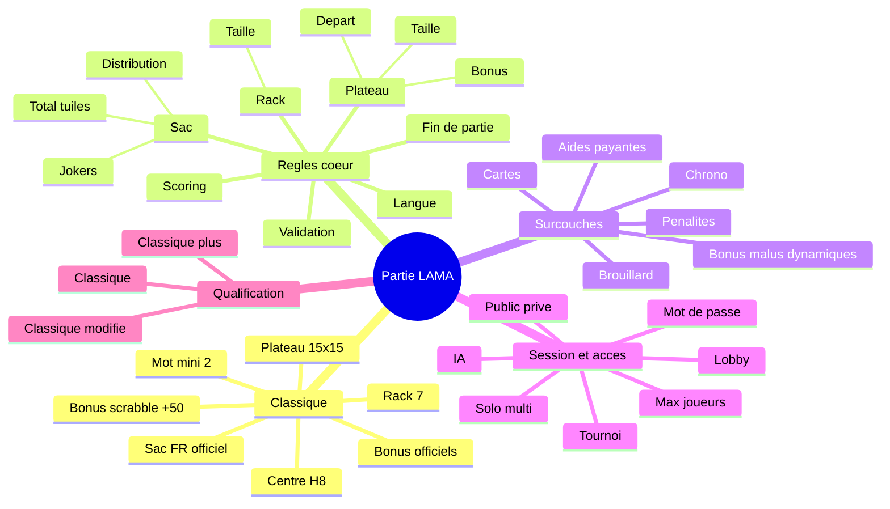

# Modes de jeu, variantes et options de partie — grille de décision

**Date** : 2026-06-20
**Statut** : Proposition

---

## Objectif

Clarifier l'ensemble des paramètres d'une partie LAMA à partir d'un socle par défaut nommé `classique`.

Le but est double :

1. **visualiser** ce qui constitue le jeu de base ;
2. **qualifier** ce qui fait basculer une partie vers `classique+` ou `classique modifié`.

Ce document combine :

- une **grille de décision** ;
- une **carte mentale** ;
- un repérage du statut de chaque option : `implémenté`, `partiel`, `futur`.

> Règle d'interprétation : si la documentation diverge du code, le code fait foi.

---

## Glossaire de travail

### `classique`

Partie conforme au socle de référence par défaut, sans variante activée.

### `classique+`

Partie dont le **socle classique reste intact**, mais à laquelle on ajoute une ou plusieurs couches complémentaires :

- options de session/lobby ;
- chrono ;
- cartes ;
- brouillard/visibilité ;
- aides payantes ;
- règles annexes non destructrices.

Le coeur du plateau, du sac, du rack et du scoring de référence n'est pas modifié.

### `classique modifié`

Partie où une **règle structurante du socle** change, par exemple :

- taille du plateau ;
- carte des bonus ;
- taille du rack ;
- contenu du sac ;
- langue/dictionnaire de référence ;
- seuil de longueur minimale ;
- bonus de scrabble ;
- règles de score ou de validation.

### `option de session`

Paramètre qui change l'expérience de création/rejointure/lobby sans changer les règles du coup joué.
Exemples : partie ouverte/fermée, mot de passe, nombre max de joueurs, IA, lobby explicite.

---

## Socle recommandé : `classique`

### Définition produit

Le mode `classique` est la **base par défaut**. Il sert de référence de comparaison pour toutes les variantes.

### Référence actuelle observée dans le code

| Élément | Valeur de référence | Statut actuel | Sources principales |
|---------|---------------------|---------------|---------------------|
| Plateau | 15×15 | Implémenté | `src/libs/Lama.Contracts/GameEntities.cs`, `src/libs/Lama.Domain/Board/BonusMap.cs` |
| Case départ | centre `H8` | Implémenté | `src/libs/Lama.Domain/Validation/MoveValidator.cs` |
| Bonus plateau | disposition officielle Scrabble 15×15 | Implémenté | `src/libs/Lama.Domain/Board/BonusMap.cs` |
| Rack | 7 lettres | Implémenté | `src/libs/Lama.Domain/Engine/GameEngine.cs` |
| Sac FR | 102 tuiles, dont 2 jokers | Implémenté | `src/libs/Lama.Languages.fr/assets/tile-distribution.json` |
| Longueur mini mot | 2 | Implémenté | `src/libs/Lama.Domain/Validation/MoveValidator.cs` |
| Bonus scrabble | +50 pour 7 tuiles | Implémenté | `src/libs/Lama.Domain/Scoring/ScoreCalculator.cs` |
| Langue par défaut | `fr` | Implémenté | `src/libs/Lama.Core/Models/GameModels.cs`, `src/Server/Lama.Server/Contracts/Api/OnlineContracts.cs` |
| Chrono | aucun par défaut | Futur | aucun moteur dédié trouvé |

### Convention de nommage proposée

- **aucune variante** active → `classique`
- **surcouche compatible** sans altérer les règles de base → `classique+`
- **modification d'une règle structurante** → `classique modifié`

Exemples :

- `classique`
- `classique+ privé`
- `classique+ chrono 10 min`
- `classique+ cartes`
- `classique modifié — rack 8`
- `classique modifié — plateau 17x17`
- `classique modifié — anglais`

---

## Règle de décision rapide

### 1. Est-ce qu'une règle coeur change ?

Si oui, la partie devient **`classique modifié`**.

Règles coeur :

- plateau ;
- bonus ;
- sac ;
- rack ;
- scoring ;
- dictionnaire/langue ;
- validation des mots ;
- longueur minimale ;
- conditions de fin de partie.

### 2. Sinon, est-ce qu'on ajoute une couche de comportement ?

Si oui, la partie devient **`classique+`**.

Surcouches typiques :

- chrono ;
- lobby ;
- partie privée ;
- IA ;
- cartes ;
- brouillard ;
- aides payantes ;
- pénalités avancées.

### 3. Sinon

La partie reste **`classique`**.

---

## Grille de décision

### Légende de statut

- **Implémenté** : exposé et réellement supporté de bout en bout.
- **Partiel** : présent dans certains contrats / providers / persistance, mais pas cohérent de bout en bout.
- **Futur** : idée documentée ou axe produit, sans support fonctionnel complet.

### A. Règles coeur du jeu

| Famille | Option | Valeurs / exemples | Impact de nommage | Statut | Lecture du code actuel |
|---------|--------|--------------------|-------------------|--------|------------------------|
| Plateau | Taille du plateau | 15×15, 17×17, 19×19 | `classique modifié` si ≠ 15×15 | **Partiel** | `BoardSize` existe dans les contrats et la persistance, mais le domaine reste codé en dur à 15×15 (`Position.IsValid`, `BoardState`, `BonusMap`, boucles du moteur) |
| Plateau | Carte des bonus | classique officielle, custom, aléatoire | `classique modifié` | **Implémenté** pour le classique seulement | la carte officielle 15×15 existe ; aucune variante de bonus n'est injectée |
| Plateau | Case départ | centre, autre case | `classique modifié` si ≠ centre | **Implémenté** pour centre seulement | `MoveValidator` impose `H8` |
| Rack | Taille du rack | 7, 8, 9 | `classique modifié` si ≠ 7 | **Partiel** | `RackSize` existe dans les requêtes/DTO, mais `GameEngine` garde `RackSize = 7` |
| Sac | Distribution des tuiles | FR officielle, réduite, étendue, custom | `classique modifié` si ≠ référence | **Partiel** | la distribution varie côté provider/profil, mais le moteur ne sait pas qualifier le mode résultant |
| Sac | Nombre total de tuiles | 102, 90, 120 | `classique modifié` | **Partiel** | possible indirectement via distribution ; pas encore piloté comme option explicite nommée |
| Sac | Jokers | 0, 1, 2, 3 | `classique modifié` si ≠ 2 | **Partiel** | gérable via distribution, pas exposé comme choix métier lisible |
| Langue | Dictionnaire/langue | fr, en, bilingue | `classique modifié` si ≠ FR classique | **Partiel** | interface multilingue prête, provider FR présent, doc d'évolution bilingue existante |
| Validation | Longueur min de mot | 2, 3 | `classique modifié` si ≠ 2 | **Partiel** | champ dans contrats et persistance, mais `MoveValidator` impose encore 2 en dur |
| Scoring | Bonus scrabble | +50 / autre valeur / off | `classique modifié` | **Implémenté** pour +50 uniquement | `ScoreCalculator` fixe +50 pour 7 lettres |
| Scoring | Valeur des lettres | officielle FR, alternative | `classique modifié` | **Partiel** | les scores viennent du provider, mais pas encore portés comme preset de mode nommé |
| Fin de partie | sac vide + rack vide, max tours, score cible | règles fin officielles ou variantes | `classique modifié` si la règle change | **Partiel** | fin officielle principale en moteur ; `README.md` mentionne max tours / score cible sans support métier identifié |

### B. Variantes additives compatibles avec le socle

| Famille | Option | Valeurs / exemples | Impact de nommage | Statut | Lecture du code actuel |
|---------|--------|--------------------|-------------------|--------|------------------------|
| Cadence | Chrono global | 5 min, 10 min, Fischer, Bronstein | `classique+` | **Futur** | aucun moteur de temps de partie trouvé |
| Cadence | Temps par coup | 30 s, 60 s, 90 s | `classique+` | **Futur** | aucun contrat métier dédié trouvé |
| Plateau avancé | Cases bonus/malus dynamiques | visible, caché, fog | `classique+` ou `classique modifié` selon effet | **Futur** | décrit dans `docs/roadmap/PERIMETRE.md` |
| Cartes | cartes action | on/off, boost, protection, attaque | `classique+` | **Futur** | pas d'implémentation repérée |
| Économie | actions payantes | `play.check` payant, achat de lettre | `classique+` | **Futur** | décrit dans `docs/roadmap/PERIMETRE.md` |
| Pénalités | challenge raté / spam check | off/on + paramètres | `classique+` | **Futur** | pas de système de pénalité configurable aujourd'hui |
| Visibilité | brouillard / info partielle | none, local, hidden | `classique+` | **Futur** | aucune projection runtime actuelle |
| Seed | seed de partie | fixe / random persistante | `classique+` | **Futur** | évoqué dans la roadmap, pas dans le moteur |

### C. Options de session / lobby / accès

> Ces options ne changent pas les règles du coup lui-même, mais changent l'expérience de partie.
> Par convention produit, elles classent la partie en **`classique+`** si activées.

| Famille | Option | Valeurs / exemples | Impact de nommage | Statut | Lecture du code actuel |
|---------|--------|--------------------|-------------------|--------|------------------------|
| Session | Partie ouverte / fermée | publique, privée | `classique+` | **Implémenté** online | `IsPrivate`, `Password`, validations serveur présentes |
| Session | Mot de passe | aucun / requis | `classique+` | **Implémenté** online | hash SHA-256 + vérification côté serveur |
| Session | Lobby explicite | auto-start / start manuel | `classique+` | **Implémenté** online | `HasStarted`, `UsesLobby`, endpoint `start` |
| Session | Type solo/multi | solo, multi | `classique+` | **Implémenté** online | `OnlineGameMode` + validations serveur |
| Session | Nombre max de joueurs | 1..4 | `classique+` | **Implémenté** online | `MaxPlayers` validé dans `GamesCommandEndpoints` |
| Session | IA | on/off | `classique+` | **Partiel** | réservation de slot IA et flag présents, mais comportement IA non visible ici |
| Session | Nom de partie | libre | sans impact sur règles | **Implémenté** online | `GameName` géré côté serveur |
| Session | Tournoi / queue | open, tournament, global | `classique+` ou mode organisationnel | **Partiel** | queue/rating présents ; pas encore un preset métier complet de règles |

### D. Exposition produit / contrats / infrastructure

| Famille | Option | Valeurs / exemples | Impact de nommage | Statut | Lecture du code actuel |
|---------|--------|--------------------|-------------------|--------|------------------------|
| Contrat | `GameLevel` | casual, standard, competitive, tournament | dépend du preset retenu | **Implémenté** | niveau exposé CLI + core + server |
| Contrat | `GameType` | classic, tournament, duplicate, blitz | dépend du preset retenu | **Partiel** | vu dans `TileDistributionProfile` et les multiplicateurs de provider |
| Contrat | `BoardSize` | entier | `classique modifié` si ≠ 15 | **Partiel** | stocké/transmis, mais non respecté par tout le domaine |
| Contrat | `RackSize` | entier | `classique modifié` si ≠ 7 | **Partiel** | stocké/transmis, mais non respecté par tout le domaine |
| Contrat | `Language` | `fr`, autre | `classique modifié` si ≠ FR | **Partiel** | la tuyauterie existe, mais peu de providers concrets |
| Persistance | sauvegarder le mode résultant | `classique`, `classique+ ...`, `classique modifié ...` | n/a | **Futur** | aucun champ métier unifié "ruleset/mode" repéré |

---

## Carte mentale — version texte

```text
Partie LAMA
└── Socle de référence
    └── classique
        ├── Plateau 15x15
        ├── Centre H8
        ├── Bonus officiels
        ├── Rack 7
        ├── Sac FR officiel (102, dont 2 jokers)
        ├── Mot mini = 2
        └── Bonus scrabble = +50

Variantes
├── 1. Règles coeur
│   ├── Plateau
│   │   ├── taille
│   │   ├── carte des bonus
│   │   └── case de départ
│   ├── Rack
│   │   └── taille
│   ├── Sac
│   │   ├── distribution
│   │   ├── jokers
│   │   └── total tuiles
│   ├── Langue / dictionnaire
│   ├── Scoring
│   │   ├── valeurs lettres
│   │   └── bonus scrabble
│   ├── Validation
│   │   └── mot mini / contraintes
│   └── Fin de partie
│       ├── officielle
│       ├── max tours
│       └── score cible
│
├── 2. Surcouches compatibles
│   ├── chrono
│   ├── cartes
│   ├── bonus/malus dynamiques
│   ├── brouillard
│   ├── aides payantes
│   └── pénalités avancées
│
├── 3. Session / lobby / accès
│   ├── solo / multi
│   ├── public / privé
│   ├── mot de passe
│   ├── lobby manuel
│   ├── max joueurs
│   ├── IA
│   └── tournoi / queue
│
└── 4. Qualification finale
    ├── rien ne change -> classique
    ├── surcouche non destructive -> classique+
    └── règle coeur modifiée -> classique modifié
```

---

## Carte mentale — version Mermaid



---

## Tableau de qualification rapide

| Cas | Résultat recommandé |
|-----|---------------------|
| Partie FR 15×15, rack 7, sac officiel, sans chrono, publique | `classique` |
| Même règles, mais partie privée avec mot de passe | `classique+ privé` |
| Même règles, mais lobby multi + IA | `classique+ lobby/IA` |
| Même règles, mais chrono 10 min | `classique+ chrono 10 min` |
| Plateau 17×17 | `classique modifié — plateau 17x17` |
| Rack 8 | `classique modifié — rack 8` |
| Distribution FR alternative | `classique modifié — sac alternatif` |
| Langue anglaise | `classique modifié — anglais` |
| Bonus dynamiques visibles + règles classiques inchangées | `classique+ bonus dynamiques` |
| Bonus officiels remplacés par une autre carte | `classique modifié — carte bonus custom` |

---

## Lecture de l'existant : synthèse courte

### Déjà solide

- mode classique FR 15×15 ;
- bonus officiels ;
- centre `H8` ;
- rack 7 ;
- sac FR de référence ;
- challenge, échange, passage ;
- options online de session : public/privé, mot de passe, solo/multi, lobby, max joueurs.

### Déjà amorcé mais pas homogène

- `BoardSize` ;
- `RackSize` ;
- `Language` ;
- `GameType` / multiplicateurs (`classic`, `duplicate`, `blitz`, `tournament`) ;
- `MinWordLength`.

Ces paramètres existent dans certains **contrats** ou **providers**, mais pas encore comme **système de règles cohérent de bout en bout** dans le domaine.

### Clairement futur

- chrono ;
- cartes action ;
- cases bonus/malus dynamiques ;
- brouillard ;
- seed de partie ;
- pénalités configurables ;
- économie de points pour les aides.

---

## Recommandation de modélisation future

Pour passer de cette cartographie à un vrai système de modes nommés, il est recommandé d'introduire plus tard un objet métier central du type :

- `GameRulesDefinition` ou `NamedGameModeDefinition`

avec séparation explicite entre :

1. **Socle règles coeur**
2. **Surcouches optionnelles**
3. **Options de session/lobby**
4. **Nom calculé du mode résultant**

Exemple de logique produit cible :

- preset `classique`
- preset `classique+chrono`
- preset `classique+prive`
- preset `classique modifie plateau17`
- preset `classique modifie rack8`

---

## Sources relues pour ce cadrage

- `README.md`
- `docs/roadmap/PERIMETRE.md`
- `src/libs/Lama.Contracts/GameEntities.cs`
- `src/libs/Lama.Contracts/TileDistributionProfile.cs`
- `src/libs/Lama.Domain/Board/BonusMap.cs`
- `src/libs/Lama.Domain/Validation/MoveValidator.cs`
- `src/libs/Lama.Domain/Engine/GameEngine.cs`
- `src/libs/Lama.Domain/Scoring/ScoreCalculator.cs`
- `src/libs/Lama.Languages.fr/assets/tile-distribution.json`
- `src/libs/Lama.Core/Models/GameModels.cs`
- `src/Console/Lama.Console/Commands/Game/GameCreateCommand.cs`
- `src/Console/Lama.Console/Services/OnlineGameGateway.cs`
- `src/Server/Lama.Server/Contracts/Api/OnlineContracts.cs`
- `src/Server/Lama.Server/Endpoints/Games/GamesCommandEndpoints.cs`

